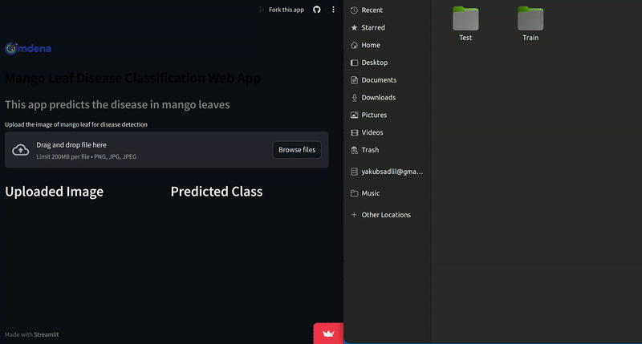

<h1 align="center">
  🌟 Real-time Automated Mango Leaf Disease Detection in Bangladesh using CNNs 
</h1>

 
Detect and classify Bangladeshi mango leaf diseases in real-time with our cutting-edge Computer Vision model with 99.21 % accuracy, minimizing yield losses and empowering farmers.

  

<h3 align = "center"> 👀 Please have a look at our beautiful, well-documented <a href="/src/tasks/task-3-model-training/Best-Model/ResNet50/mango-leaf-disease-detection-using-cnn.ipynb">Notebook</a></h3>

## Table of Contents
- [Problem](#problem)
- [Project Goals](#project-goals)
- [Data](#data)
- [Achievements](#achievements)
- [Deployment](#deployment)
- [Project Structure](#project-structure)
- [Folder Overview](#folder-overview)
- [Contribution Guidelines](#contribution-guidelines)

## Problem
Bacterial and fungal diseases are major constraints for mango production, causing around 30% yield loss annually. The absence of real-time, automated systems for early detection and classification of mango leaf diseases hampers efforts to mitigate crop losses. Currently, farmers face delayed diagnoses which reduces productivity and causes financial losses. This project aims to address this problem by developing a cutting-edge Computer Vision-based model that provides instant in-field detection and classification of mango leaf diseases, empowering farmers with timely information to reduce losses and enhance their income.

## Project Goals
Collect a comprehensive dataset of mango leaf images encompassing multiple bacterial and fungal diseases, ensuring representation across various regions.
Train and optimize Convolutional Neural Network (CNN) models to accurately detect and classify mango leaf diseases using the collected dataset.
Develop an intuitive user interface with trained models for real-time mango disease screening by farmers.
Learning Outcomes:
Gain hands-on experience in training CNN models using popular frameworks such as TensorFlow, applying transfer learning, and optimizing model performance.
Acquire knowledge and best practices for collecting high-quality data and annotations for training machine learning models in agricultural contexts.
Develop proficiency in deploying deep learning models for real-world applications, specifically in the field of agriculture.
Experience collaborating with a diverse team to build an end-to-end applied AI solution.

## Data

The model is trained on a dataset of 3600 mango leaf images representing 7 common diseases and healthy leaves. The dataset was downloaded from data.mendeley.com which was collected from orchards in various mango-growing regions of Bangladesh.

The classes:

    Bacterial Canker
    Anthracnose
    Powdery Mildew
    Leaf Spot
    Die Back
    Sooty Mold
    Healthy

The dataset is split into train and validation sets.
However, we created a test set and our team has removed the duplicates and augmented images from the original dataset.

## Achievements
The model uses a ResNet50 architecture pre-trained on ImageNet weights. The model achieves an accuracy of 99.21% on the test set.

## Deployment
We deployed the model through Flask and streamlit. You have the option to interact with the project's live demo [here](https://mango-leaf-disease-app-omdena.streamlit.app/)

## Project Structure

    ├── LICENSE
    ├── README.md          <- The top-level README for developers/collaborators using this project.
    ├── original           <- Original Source Code of the challenge hosted by Omdena. Can be used as a reference code for the current project goal.
    │ 
    │
    ├── reports            <- Folder containing the final reports/results of this project
    │   └── README.md      <- Details about final reports and analysis
    │ 
    │   
    ├── src                <- Source code folder for this project
        │
        ├── data           <- Datasets used and collected for this project
        │   
        ├── docs           <- Folder for Task documentation, Meeting Presentations and task Workflow Documents and Diagrams.
        │
        ├── references     <- Data dictionaries, manuals, and all other explanatory references used 
        │
        ├── tasks          <- Master folder for all individual task folders
        │
        ├── visualizations <- Code and Visualization dashboards generated for the project
        │
        └── results        <- Folder to store Final analysis and modeling results and code.
--------

## Folder Overview

- Original          - Folder Containing old/completed Omdena challenge code.
- Reports           - Folder to store all Final Reports of this project
- Data              - Folder to Store all the data collected and used for this project 
- Docs              - Folder for Task documentation, Meeting Presentations and task Workflow Documents and Diagrams.
- References        - Folder to store any reference code/research papers and other useful documents used for this project
- Tasks             - Master folder for all tasks
  - All Task Folder names should follow the specific naming convention
  - All Task folder names should be in chronological order (from 1 to n)
  - All Task folders should have a README.md file with task Details and task goals along with an info table containing all code/notebook files with their links and information
  - Update the [task-table](./src/tasks/README.md#task-table) whenever a task is created and explain the purpose and goals of the task to others.
- Visualization     - Folder to store dashboards, analysis and visualization reports
- Results           - Folder to store final analysis modeling results for the project.

## Contribution Guidelines
- Have a Look at the [project structure](#project-structure) and [folder overview](#folder-overview) below to understand where to store/upload your contribution
- If you're creating a task, Go to the task folder and create a new folder with the below naming convention and add a README.md with task details and goals to help other contributors understand
    - Task Folder Naming Convention : _task-n-taskname.(n is the task number)_  ex: task-1-data-analysis, task-2-model-deployment etc.
    - Create a README.md with a table containing information table about all contributions for the task.
- If you're contributing to a task, please make sure to store it in the relevant location and update the README.md information table with your contribution details.
- Make sure your File names(jupyter notebooks, python files, datasheet file names etc) have proper naming to help others easily identify them.
- Please restrict yourself from creating unnecessary folders other than in the 'tasks' folder (as per the above-mentioned naming convention) to avoid confusion. 
